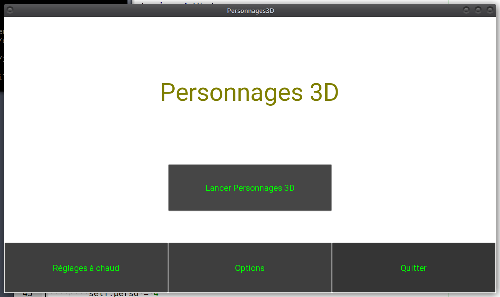

# personnages3d

Pose Estimation with Intel Realsense Posenet Coral

<p align="center">

</p>


### Détection de 1 à 4 personnes
* Inferface graphique réalisée avec Kivy
* Suivi des personnes devant la caméra

### Installation
#### Coral
```bash
sudo apt install python3-venv
python3 -m pip install --upgrade pip
sudo apt install python3-pip
python3 -m pip install --user --upgrade pip
echo "deb https://packages.cloud.google.com/apt coral-edgetpu-stable main" | sudo tee /etc/apt/sources.list.d/coral-edgetpu.list
echo "deb https://packages.cloud.google.com/apt coral-cloud-stable main" | sudo tee /etc/apt/sources.list.d/coral-cloud.list
curl https://packages.cloud.google.com/apt/doc/apt-key.gpg | sudo apt-key add -
sudo pluma /etc/apt/sources.list
echo "deb https://packages.cloud.google.com/apt coral-edgetpu-stable main" | sudo tee /etc/apt/sources.list.d/coral-edgetpu.list
sudo apt install curl
curl -s https://packages.cloud.google.com/apt/doc/apt-key.gpg | sudo apt-key add -
sudo apt update
sudo apt install edgetpu-compiler gasket-dkms libedgetpu1-std
```
revoir
python3-tflite-runtime

#### RealSense
```bash
sudo apt-key adv --keyserver keys.gnupg.net --recv-key F6E65AC044F831AC80A06380C8B3A55A6F3EFCDE || sudo apt-key adv --keyserver hkp://keyserver.ubuntu.com:80 --recv-key F6E65AC044F831AC80A06380C8B3A55A6F3EFCDE
sudo pluma /etc/apt/sources.list
sudo apt update
sudo apt install librealsense2-dkms
sudo apt install -f librealsense2-utils
```

#### Pycoral
Le pycoral de pip (pypi) n'est pas celui de Coral.
```bash
sudo apt install python3-pycoral python3-tflite-runtime
```

#### Python
```bash
cd /le/projet/personnages3d
python3 -m venv --system-site-packages mon_env
source mon_env/bin/activate
python3 -m pip install -r requirements.txt
```
--system-site-packages permet à venv d'accéder aux packages system où sont installé pycoral et tflite-runtime

#### Depuis les sources sur GitHub

Plantage avec le github direct qui impose tflite-runtime==2.5.0.post1

```bash
python3 -m pip install -e git+https://github.com/google-coral/pycoral#egg=pycoral
```

#### Depuis un clone local
Ne trouve pas pycoral
```bash
python3 -m pip install --no-index --find-links=/media/data/exclude/clones/pycoral pycoral
```
